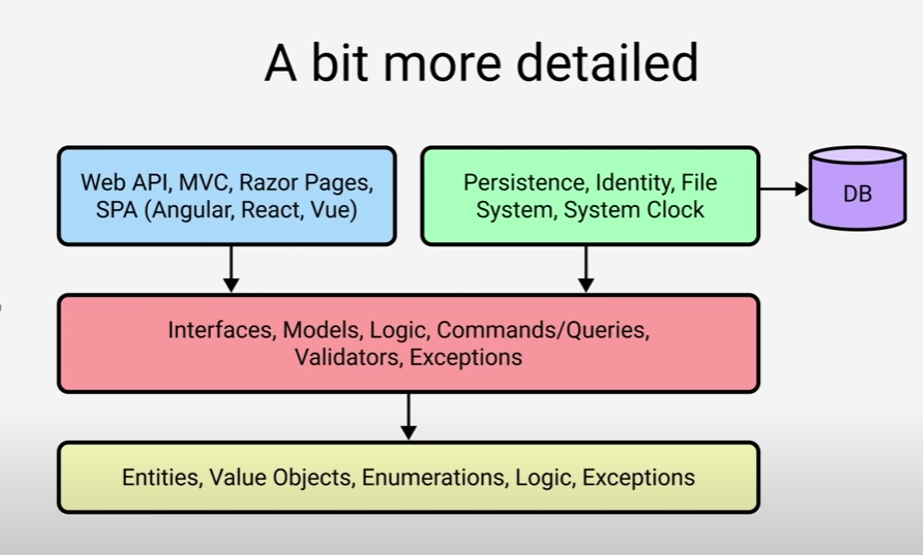

## Secrets -> JWT

[Safe storage of app secrets in development in ASP.NET Core](https://learn.microsoft.com/en-us/aspnet/core/security/app-secrets?view=aspnetcore-8.0&tabs=windows)

## Error handling

[RFC 7807 - Problem Details for HTTP APIs](https://datatracker.ietf.org/doc/html/rfc7807)
